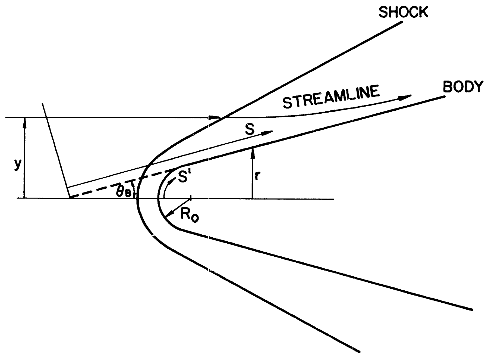

  

Joseph Steer 28/01/2026

This software was developed to solve equation 16 from: 

Rotta NR. Effects of nose bluntness on the boundary layer characteristics of conical bodies at hypersonic speeds. 1966 Nov 1

Run the code by inputting the desired cone properties in rotta.py and then running the same file. j.py, f.py, and shape.py contain functions written to determine j(y_bar), f(eta_e), and the shock shape from the correlation given in the paper. A text file of outputs in then created containing the non-dimensional parameter s_bar and Me, the Mach number at the boundary layer edge.

Some comments on the implementation:
- The result is sensitive to the solution tolerance allowed for f(eta_e). Rotta does not provide any detail about how he chose this, or indeed what pressure gradient parameter (beta) was used
- In determination of j(y_bar), it seems that it was common practice to isentropically expand the post-shock properties to the cone surface pressure determined using Taylor-Maccoll / modified Newtonian method. A single pressure value seems to have been used by Rotta, which leads to (in my opinion) a non-physical Mach number at the stagnation point. This could be improved if desired by expressing the surface pressure as a function of s_bar
- In order to produce the figures in the validation folder, I had to use a linear viscosity model i.e. mu is directly proportional to T. If using Sutherland's law, the Mach 20 result can not be reproduced. I think it is really better to use Sutherland's law, however at Mach 20 (~8000K) one will likely encounter real gas effects that would change the solution anyway

Enjoy! 
